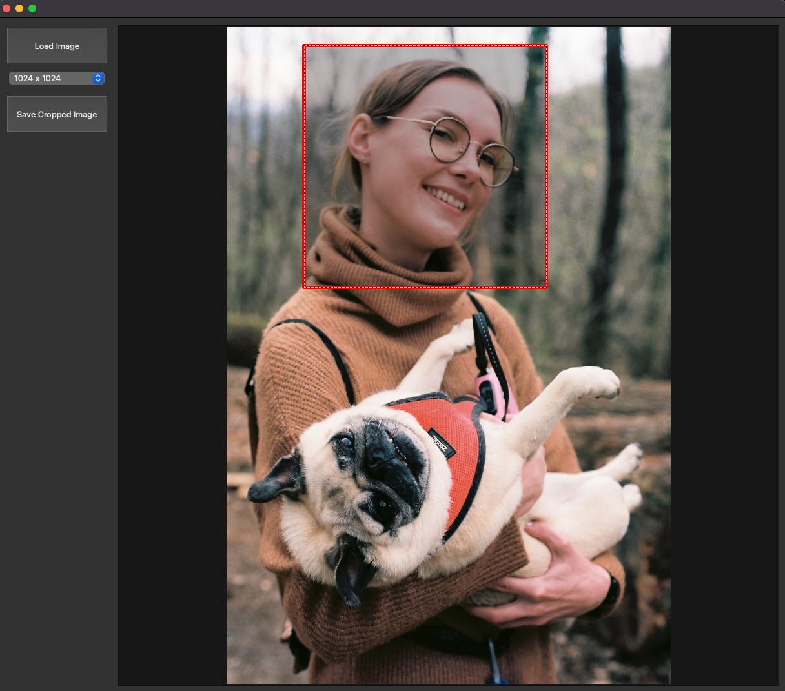

# Lora Image Cropper

Lora Image Cropper is a simple Qt desktop application for cropping images. It allows you to load an image, crop it to a specific size, and save the cropped image to a file. It's a quick and convenient way to prepare images for fine-tuning generative AI models with lora weights.

## Installation

To install Lora Image Cropper, follow these steps:

1. Clone the repository to your local machine.
2. Install the required dependencies by running `pip install -r requirements.txt`.
3. Run the application by running `python app.py`.

## Usage

To use Lora Image Cropper, follow these steps:

1. Click the "Load Image" button to load an image.
2. Use the mouse to resize a rectangle over the area of the image you want to crop.
3. Use the "Save Cropped Image" button to save the cropped image to a file.

You can also select the size of the cropped image using the "Image Size" dropdown menu.

## Contributing

If you would like to contribute to Lora Image Cropper, please follow these steps:

1. Fork the repository.
2. Create a new branch for your feature or bug fix.
3. Make your changes and commit them with descriptive commit messages.
4. Push your changes to your fork.
5. Submit a pull request to the main repository.

## License

Lora Image Cropper is licensed under the MIT License. See LICENSE for more information.
